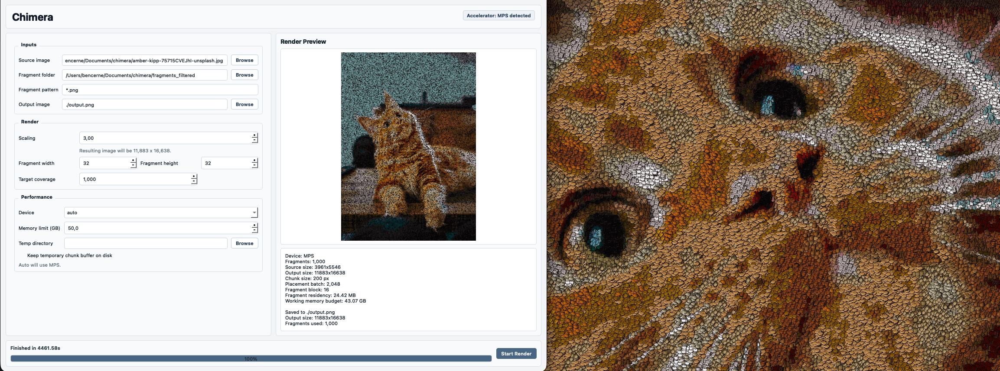

# Chimera

**GPU-Accelerated Mosaic Reconstruction from Fragment Images**

Did you ever want to reconstruct the Hubble Deep Field from emojis, or movie scenes from video game items, or cats from dogs, or the moon from cheese? Well, me neither, but somehow here we are. Chimera reconstructs a target canvas image from thousands of fragment images.

Perhaps can be used to make some cool posters that look very different up close and far away :)

<video src="https://github.com/user-attachments/assets/e6c8fc88-7b75-4eec-94d8-4a2816479d6d"
       width="640" controls loop muted playsinline>
  Your browser does not support the video tag.
</video>


## Installation

```bash
uv sync
uv run python chimera.py
```

## Usage

Select source image and scaling, the folder containing fragments, fragment resize, and memory limit suitable for your machine and accelerator.



`Note: be careful of large scalings, this is memory intensive and output images can quickly end up gigabytes in size!`
