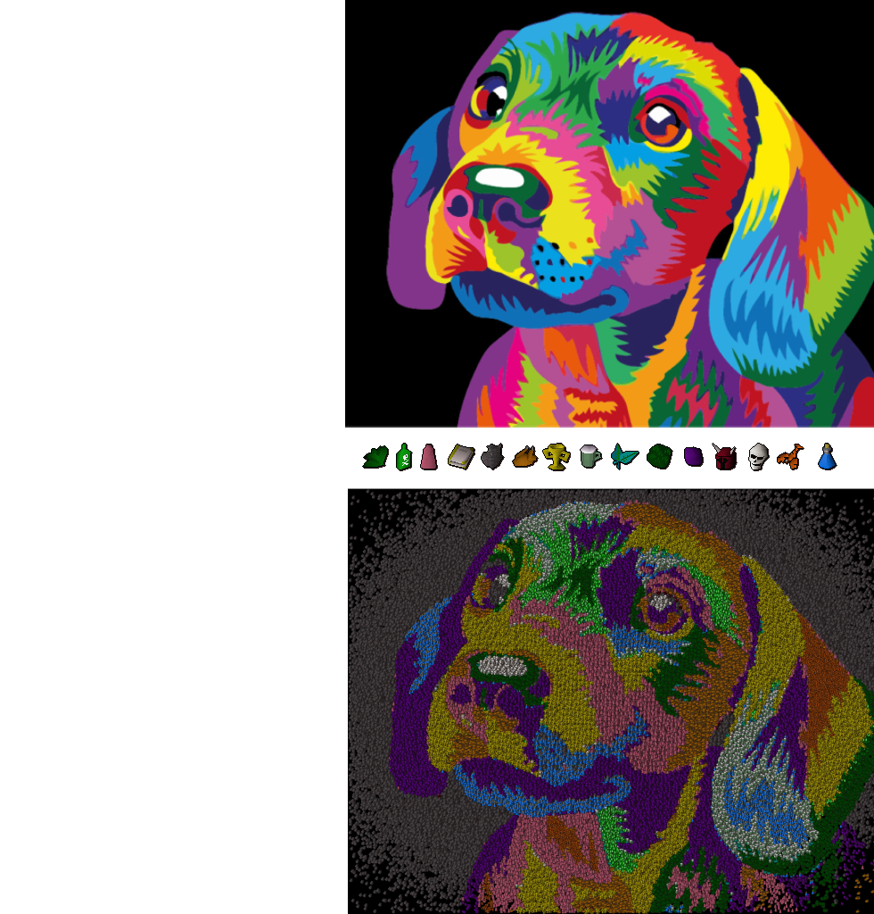

# Chimera

**GPU-Accelerated Mosaic Reconstruction from Fragment Images**

Did you ever want to reconstruct the Hubble Deep Field from emojis, or movie scenes from video game items, or cats from dogs, or the moon from cheese? Well, me neither, but somehow here we are. Chimera reconstructs a target canvas image from thousands of fragment images.

<video src="https://github.com/user-attachments/assets/e6c8fc88-7b75-4eec-94d8-4a2816479d6d"
       width="640" controls loop muted playsinline>
  Your browser does not support the video tag.
</video>


## Features

- **GPU Acceleration**: MPS, CUDA support, though 50-100x slower CPU fallback available for smaller projects
- **Fragment sub-sampling**: Automatically reduces large fragment libraries to a diverse subset for rendering speedups
- **Batch Processing**: Memory-aware batching for optimal GPU utilization. Adjustable memory usage
- **Sampling Patterns**: Gaussian, uniform, Poisson disk, spiral, concentric, Halton, jittered grid, regular grid
- **Perceptual Color Matching**: Computations done in LAB color space for accurate human-perceived color similarity
- **Transparency Support**: Full RGBA support with alpha-weighted matching

## Installation

```bash
poetry install
```

## Usage

### Quick Start

For a quick reproducible demo (resources included in repo) supply chimera with a target canvas and a set of fragment images:
```bash
poetry run python chimera.py --canvas './canvas/puppy.jpeg' --fragments './fragments/*.png' --pattern gaussian --samples 1000000
```



To get more interesting results, you'll need to provide chimera with a diverse library of fragments. You might also want to try various sampling patterns. To capture more fine detail you might want to scale the canvas result up, while downscaling or keeping the fragments at their original size.

For instance, the main demo image of the phantom galaxy was scaled up x16, and I used [Google's Noto Emoji Set](https://github.com/googlefonts/noto-emoji) of 3731 fragments at 32x32 resolution. This is too many to compute reasonbly for a 31632x18080 canvas, and under default settings the sub-sampling reduced this library to just 728 diverse fragments that can capture enough structure and colour for a good result. I used 90% of my available VRAM and reconstructed the canvas from 10m fragment samples under the halton sampling pattern:

```bash
poetry run python chimera.py --samples 10000000 --memory-fraction 0.9 --pattern halton --canvas ./canvas/jwst-phantom.jpg --fragments ./noto-32/*.png --scaling 16 --device mps --output emoji_phantom.png
```

You have a lot of fine-grained control over the quality and speed of results you may get; see args section below.

## Args

```
--canvas PATH
    Path to input canvas image to reconstruct
    Default: ./canvas/puppy.jpeg
    Formats: PNG, JPG, JPEG, BMP, GIF
    Example: --canvas my_photo.jpg

--fragments PATTERN
    Glob pattern matching fragment images to use
    Default: ./fragments/*.png
    Supports wildcards: *, **, ?, [abc]
    Example: --fragments "./emojis/**/*.png"

--output PATH
    Path where output mosaic will be saved
    Default: output.png
    Formats: PNG (recommended), JPG, BMP
    Example: --output result.png

--samples N
    Number of fragment positions to place on canvas
    Default: 90000
    Range: 1000-500000+
    More samples = better coverage, longer time
    Example: --samples 150000

--scaling FACTOR
    Factor to scale canvas size before processing
    Default: 3.0
    Range: 1.0-10.0
    Higher = more detail, slower processing
    Example: --scaling 4.0

--fragment-size W H
    Dimensions (width height) for resizing all fragments
    Default: 32 32
    Generally keep this at or below original fragment dimensions. Downscaling = faster & less quality
    Example: --fragment-size 48 48

--no-show
    Don't display output image after completion
    Default: False (will show image)
    Example: --no-show

--device {auto,cuda,mps,cpu}
    Compute device for processing
    Default: auto
    Choices: auto, cuda, mps, cpu
    Example: --device mps

--memory-fraction FRAC
    Fraction of available system memory to use
    Default: 0.5 (50%)
    Range: 0.1-0.9
    Controls batch size and memory usage
    Example: --memory-fraction 0.7

--pattern {gaussian,uniform,poisson,spiral,concentric,halton,jittered_grid}
    Sampling pattern for fragment placement
    Default: gaussian
    Patterns:
        gaussian       - Normal distribution, dense center
        uniform        - Pure random
        poisson        - Even spacing, no clusters
        halton         - Low-discrepancy, optimal coverage
        spiral         - Spiral from center
        concentric     - Concentric circles
        jittered_grid  - Grid with jitter
    Example: --pattern halton

--no-reduce-fragments
    Disable automatic fragment library reduction
    Default: False (reduction enabled)
    Use when:
        - Library already small (<1000 fragments)
        - Want absolute maximum quality
        - Need all fragment variety preserved
    Example: --no-reduce-fragments

--target-library-size N
    Target number of fragments after reduction (if enabled)
    Default: 800
    Only applies when reduction is enabled
    Actual output may differ based on similarity threshold
    Example: --target-library-size 1200

--similarity-threshold T
    Similarity threshold for fragment deduplication
    Default: 0.88
    Range: 0.0-1.0
    Higher = more aggressive reduction (keeps only very different fragments)
    Lower = more conservative (keeps more variety)
    Example: --similarity-threshold 0.85
```

---

## Architecture

```
┌─────────────────────────────────────────────────────────┐
│                     User Input                          │
│  (Canvas Image, Fragment Library, Parameters)           │
└────────────────────┬────────────────────────────────────┘
                     │
                     ▼
┌─────────────────────────────────────────────────────────┐
│                Device Detection                         │
│  • Auto-detect CUDA > MPS > CPU                         │
│  • Calculate available memory                           │
│  • Determine optimal batch size                         │
└────────────────────┬────────────────────────────────────┘
                     │
                     ▼
┌─────────────────────────────────────────────────────────┐
│           Fragment Library Reduction                    │
│  • Color clustering (K-means in LAB space)              │
│  • Within-cluster deduplication                         │
│  • Greedy diverse sampling                              │
└────────────────────┬────────────────────────────────────┘
                     │
                     ▼
┌─────────────────────────────────────────────────────────┐
│              Fragment Preprocessing                     │
│  • Load and resize fragments                            │
│  • Convert to LAB color space                           │
│  • Extract transparency masks                           │
│  • Transfer to GPU memory                               │
└────────────────────┬────────────────────────────────────┘
                     │
                     ▼
┌─────────────────────────────────────────────────────────┐
│             Position Generation                         │
│  • Generate sampling positions (8 patterns)             │
│  • Filter for canvas bounds                             │
└────────────────────┬────────────────────────────────────┘
                     │
                     ▼
┌─────────────────────────────────────────────────────────┐
│              Batch Processing Loop                      │
│  ┌─────────────────────────────────────────┐            │
│  │ For each batch:                         │            │
│  │ 1. Extract canvas regions               │            │
│  │ 2. Convert to LAB (GPU)                 │            │
│  │ 3. Compute MAE vs all fragments (GPU)   │            │
│  │ 4. Select best match per position       │            │
│  │ 5. Paste fragments to output            │            │
│  │ 6. Clear GPU cache                      │            │
│  └─────────────────────────────────────────┘            │
└────────────────────┬────────────────────────────────────┘
                     │
                     ▼
┌─────────────────────────────────────────────────────────┐
│                  Output Mosaic                          │
└─────────────────────────────────────────────────────────┘
```
